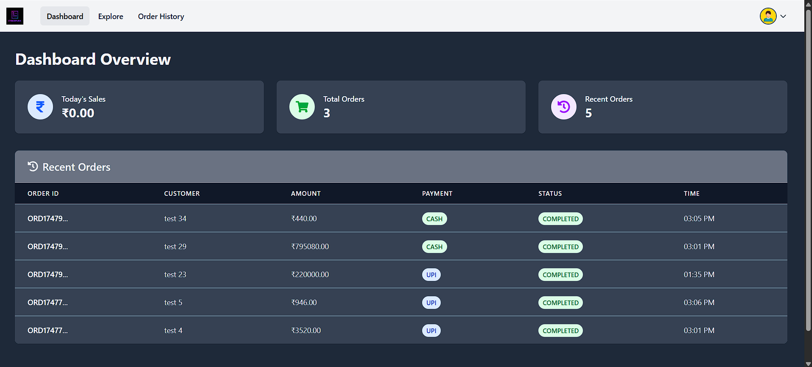
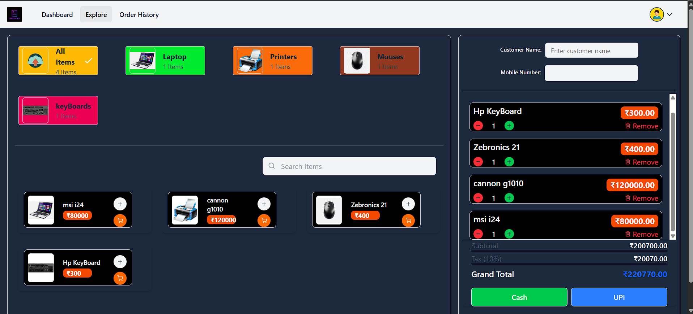
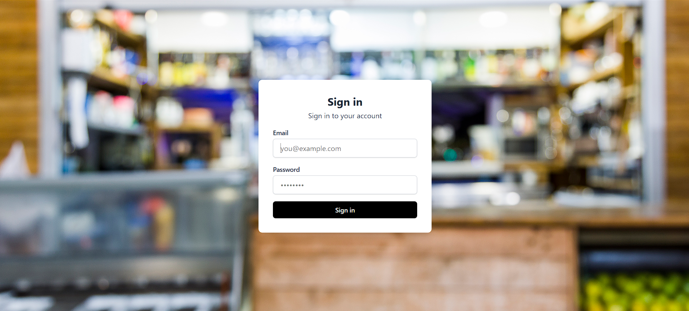
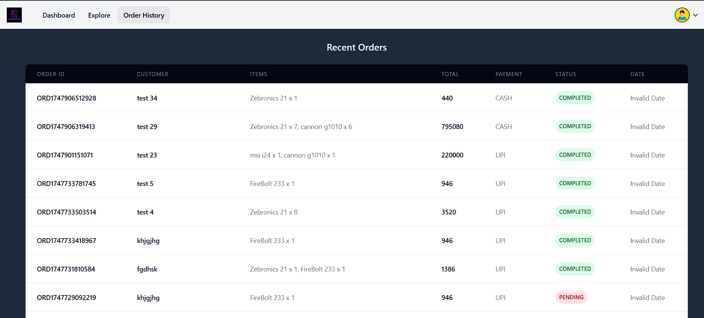

# 🧾 Billing Software

A full-stack **Billing Software** web application that allows users to manage item categories, 
add products, and handle billing efficiently. This project is built with **React** on the frontend and **Spring Boot** on the backend.

---

## 🚀 Features

- 📦 Category-wise item management
- 🔍 Real-time item search
- 🧾 Billing and total calculations
- 📤 Image upload and display
- 🖥 Responsive design (mobile, tablet, desktop)
- 🌐 RESTful APIs with Spring Boot

---

## 🛠️ Tech Stack

### Frontend
- React
- Tailwind CSS
- Axios

### Backend
- Java
- Spring Boot
- Spring MVC
- Spring Data JPA
- MySQL / PostgreSQL

---

## 📸 Screenshots

### 🏠 Home Page

### 📋 Explore Section

### 🧾 Login Page

### 🧾 Categories Page

### 🧾 items Page

### 🧾 Users Page

### 🧾 Order History  Page

---

## 🙋‍♂️ Author

**Pavan Dhote**
